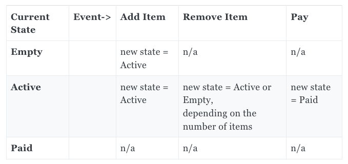

# F# labb

## Setup

Installera dotnet version 5. Om asdf är installerat finns det en .tools-version fil.
Testa följande och se att tre av testen går igenom och ett failar.
1. `dotnet restore --interactive`
1. `dotnet build`
1. `dotnet test`

När det är gjort testa att starta F# interactive med: `dotnet fsi`. (För att komma ur det skriv `#quit;;`)

## Labbar
Fundera på den här, diskussion i slutet.
Finns det något lib eller mönster som skulle ge ett värde i de pågående projekten?

### Del 1
Läs igenom [den här sidan](https://fsharpforfunandprofit.com/posts/fsharp-in-60-seconds/) om lite grundläggande F# syntax och testa att köra kommandon i REPL:n.
Klistra in en rad, avsluta med `;;` och sen enter.

### Del 2
Kolla igenom slidsen från presentationen och testa att köra några av de exemplen vi gick igenom.
Fixa det failande testet i projektet.

### Del 3
Med dessa [regler](https://fsharpforfunandprofit.com/learning-fsharp/#dos-and-donts) lös följande uppgift (endast första uppgiften) från Advent Of Code:
[AOC 2020-1](https://adventofcode.com/2020/day/1).

Finns uppsatt en grund för att börja med det här i filen [Past3.fsx](/FsharpLabs/Part3.fsx).
Filändelsen `.fsx` säger att det är en F#-scriptfil vilket innebär att man kan köra filen med följand kommando: `dotnet fsi FsharpLabs/Part3.fsx`.

Kolla gärna in [lösningsförslaget](https://github.com/rq-abrahamsson/aoc/blob/master/2020-1/App.fsx) när du är klar och fundera på vad som hade kunnat förbättras och varför (både din kod och lösningsförslaget).

BONUS: Sätt upp ett test som bekräftar att uppgiften är löst. Eller ännu bättre, sätt upp testet innan och lös det med TDD.

### Del 4 - Större uppgifter
De här uppgifterna kan göras snabbt och enkelt men de går också att ta ganska långt.
Så ni väljer själva om ni bara vill fokusera på en eller om ni vill göra lite av varje.
Bra hjälp finns från [FSharpPlus](http://fsprojects.github.io/FSharpPlus/), [FSharpCore](https://fsharp.github.io/fsharp-core-docs/), [Fsharpforfunandprofit](https://fsharpforfunandprofit.com/).
Uppgifterna är medvetet ganska öppna och stora för att ge utrymme till att utforska det som verkar intressant, så tänken är inte att bli "klar" med någon uppgift. 
Men kör ni fast eller har funderingar, tveka inte att ta hjälp för att diskutera saker.

#### 4a. Modellering - Tic-Tac-Toe

Här ska vi modellera det enkla spelet [Tic-Tac-Toe](https://en.wikipedia.org/wiki/Tic-tac-toe). Det finns en start i filen [TicTacToe.fsx](/FsharpLabs/Part3-a):
```
type InitGame = unit -> Game
type PlayerXMoves = GameState * SomeOtherStuff -> GameState
```
Följ dessa riktlinjer och kör en type first design:
* We start with types only – no implementation code.
* Every use-case or scenario corresponds to a function type, with one input and one output (which means I’ll use tuples when multiple parameters are needed).
* We work mostly top-down and outside-in, but occasionally bottom up as well.
* We ignore the UI for now. And there will be no events or observables in the design of the core domain. It will be purely functional.

När modellerandet är klart är det dags att implementera och se om modellen håller, tänk på att man vill kunna se spelet också.

När det är klart är det dags att fundera över det ni har gjort. Utgå gärna från när [Scott Wlaschin](https://fsharpforfunandprofit.com/posts/enterprise-tic-tac-toe/) gör samma sak.
Det är en väldigt lång artikel och hade lite andra utgångsvärden, men kan vara värdefullt att läsa en del och jämföra med er process och implementation.

Om ni har tid över kan ni försöka göra samma övning med JavaScript eller C# och kanske använda något funktionellt bibliotek som [Immutable.js](https://immutable-js.github.io/immutable-js/docs/#/), [Lodash](https://lodash.com/docs), [Language extensions](https://github.com/louthy/language-ext) eller något av de andra som visades upp under dragningen.

#### 4b. Railway Oriented Programming

I den här labben använder vi oss inte av script-filer utan vi kör projektet vilket görs med: `dotnet run -p FsharpLabs/FsharpLabs.fsproj`.
Så i filen [Program.fs](/FsharpLabs/Program.fs) kan man se att vi kör en funktion i filen [Rop.fs](/FsharpLabs/Part4-b/Rop.fs).
1. Implementera färdigt funktionerna som används i `addPerson` workflowet.
1. Lägg till ett test för `addPerson` i [Testfilen](/FsharpLabs.Test/Part4-b/Part4b.fs).
   Behöver man göra några ändringar för att det ska vara enkelt att testa funktionen?
1. Skriv tester och implementera resten av funktionerna.
   Hur blir koden? Blir det enkelt att följa vad som händer? Är det svårt att implementera?
1. Lägg till en lista av telefonummer till personen. Använd [NonEmptyList](http://fsprojects.github.io/FSharpPlus/reference/fsharpplus-data-nonemptylist.html) från FSharpPlus.
1. Försök att använda en mer komplex-feltyp som inte bara är av typen `string`.
1. Om ni har tid över kan ni försöka göra samma övning med JavaScript eller C# och kanske använda något funktionellt bibliotek som [Immutable.js](https://immutable-js.github.io/immutable-js/docs/#/), [Lodash](https://lodash.com/docs), [Language extensions](https://github.com/louthy/language-ext) eller något av de andra som visades upp under dragningen.

För hjälp finns Scott Wlashin med [ROP](https://fsharpforfunandprofit.com/posts/recipe-part2/) och
[Fizz Buzz](https://fsharpforfunandprofit.com/posts/railway-oriented-programming-carbonated/).

#### 4c. State machines - Checkout

Implementera en state machine för ett köpflöde, ett bra sätt att börja på är att rita upp ett schema över vilka states som kan gå var och sen implementera typer och state transitions för det.
Utgå ifrån följande state-tabell och koden som finns i [Part4-c/Checkout.fsx](/FsharpLabs/Part4-c/Checkout.fsx).


När det är gjort är kan det vara bra att fundera på vad som skulle kunna göras bättre och jämföra lösningen med [Scott Wlashin](https://fsharpforfunandprofit.com/posts/designing-with-types-representing-states/).

Nu är det dags att gå tillbaka till C# och JavaScript för att kunna jämföra den här lösningen med något i de språken.
Så gör helt enkelt samma övning med JavaScript eller C# och om ni känner att det skulle hjälpa, testa att använda ett funktionellt bibliotek som [Immutable.js](https://immutable-js.github.io/immutable-js/docs/#/), [Lodash](https://lodash.com/docs), [Language extensions](https://github.com/louthy/language-ext) eller något av de andra som visades upp under dragningen.

